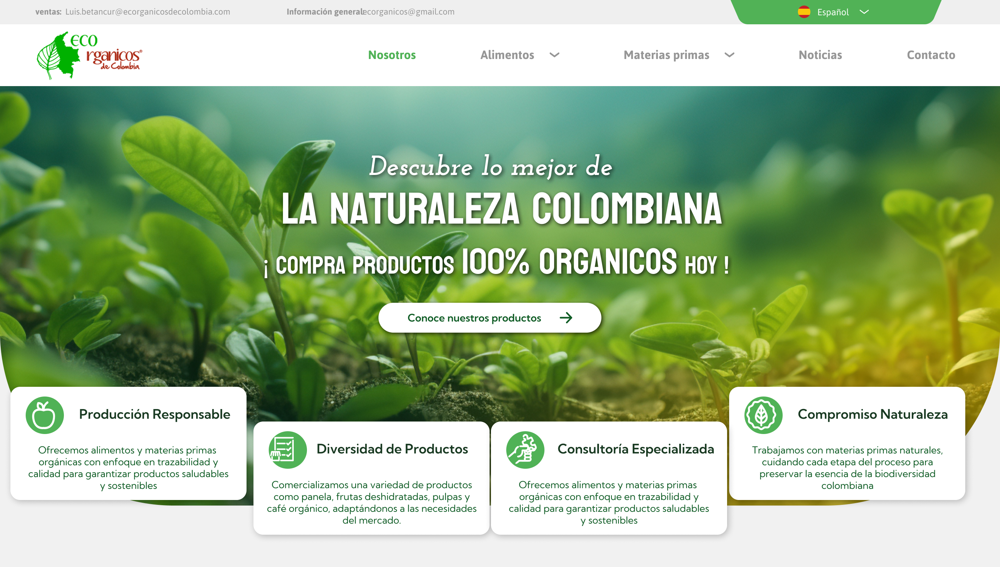
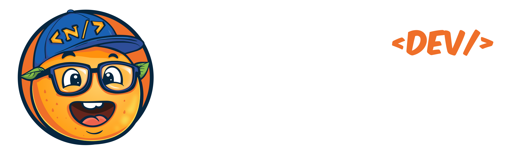

# Ecorganicos

## Descripción del Proyecto

Este proyecto consiste en el desarrollo de una landing page moderna y funcional para Ecorganicos de Colombia S.A.S. La página web está diseñada para mostrar de manera efectiva 
los servicios y productos de la compañía, destacando su compromiso con la sostenibilidad y la calidad en el sector agroindustrial.

### Sobre Ecorganicos

Ecorganicos de Colombia S.A.S. es una compañía colombiana líder en el sector agroindustrial, dedicada a:

- Exportación de productos agrícolas
- Comercialización internacional
- Producción de materias primas básicas para los sectores:

    - Agroalimentario
    - Farmacéutico

Además, Ecorganicos se distingue por ofrecer servicios de consultoría especializada en el campo de la agroindustria. Con un fuerte compromiso con la sostenibilidad y la calidad, Ecorganicos se ha posicionado como un referente en la industria, proporcionando soluciones integrales que abarcan desde la producción hasta la exportación de productos orgánicos y materias primas esenciales.

La empresa se enfoca en:

- Promover prácticas agrícolas sostenibles
- Garantizar la calidad de sus productos a través de rigurosos estándares
- Facilitar el comercio internacional de productos orgánicos
- Brindar asesoría experta para optimizar procesos agroindustriales

Este proyecto web busca reflejar la experiencia, profesionalismo y compromiso de Ecorganicos con la excelencia en todos sus servicios y productos.

<div align="center">
    
</div>

---

## 🧩 Características

La landing page de Ecorganicos está compuesta por las siguientes vistas:

- Página principal.
- Página de alimentos.
- Página de materias primas.
- Página de noticias.
- Página de contacto.

## 💻 Tecnologías

### 🎨 Diseño


### 🧑🏻‍💻 Desarrollo


### 🛠️ Herramientas


## 🗂️ Ejecutar el Proyecto Localmente

Clonar el Repositorio.

```
    git@github.com:Nisanech/ecorganicos.git
```

Ingresar a la carpeta `ecorganicos`.

```
    cd ecorganicos
```

Crear una rama local con el nombre `develop`

```
    git checkout -b develop
```

```
     git pull origin develop
```

Instalar dependencias

```
     npm install
```

Crear el archivo `.env` para las diferentes variables de entorno utilizadas en el desarrollo, para esto puedes guiarte del archivo `.env.template`.

Iniciar el proyecto.

```
     npm run dev
```

## 🧑🏻‍💻 Desarrollado Por



## 📃 Licencia

[OrangeDev Licence](LICENCE)